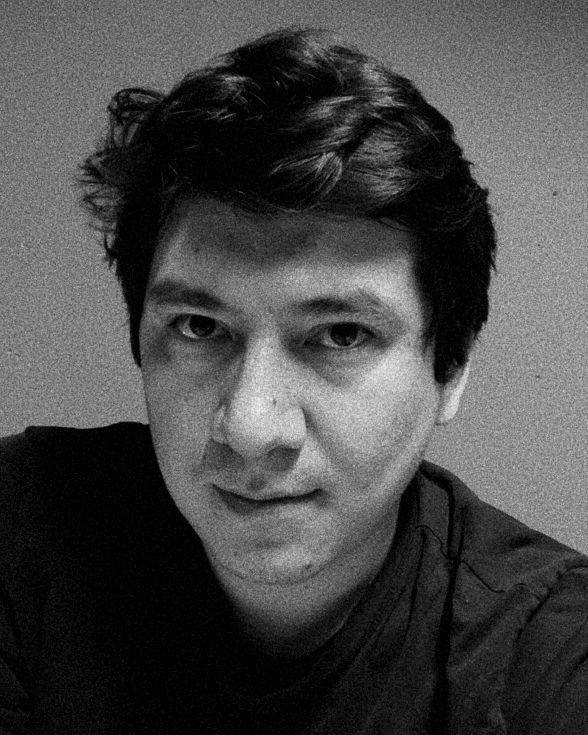
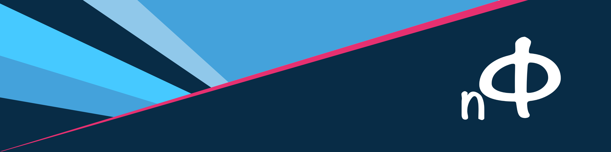

# Daniel E. Barrera Rivera

**Digital Humanities Researcher | Computational Narratologist | Literary Scholar**

Master of English Literatures and Cultures | University of Tübingen

 neophilology@gmail.com | [GitHub](https://github.com/neophilology) | [LinkedIn](https://linkedin.com/in/danielbarrera-neophilology)

---

## Research Portfolio: Entangled Narratologies

I investigate narrative as an entangled system—a network of dumb and smart actants, a compost of technologies and media, traditions and cultures intra-acting beyond the human into every aspect of our lives: identity, education, policy, memory, rituals, spirituality. My work traces these entanglements from ancient archetypes to contemporary algorithmic systems, developing an **AI narratology** that recognizes storytelling as fundamentally networked, materially embedded, and computationally mediated.

---

## Current Projects

### **Perilexemes: Character Transformation in Victorian Fiction**
[Repository - Coming Soon]

A computational framework for analyzing lexical patterns of character transformation, focalization, and narrative structure. This project develops quantitative methods to trace how dramatic arcs function as mechanisms for character development, bridging Aristotelian poetics with contemporary computational linguistics. The framework reveals how Victorian novels encode transformation through specific lexical-agent clusters—"perilexemes"—that operate below the threshold of traditional close reading yet structure reader experience at fundamental levels. This previously unrecognized narrative device in the future could become a new types of categories and relations through the study of perilexia.

### **Target as Source: Four Centuries of Odyssey Translations**
[Project Documentation](https://neophilology.github.io/English-Homer/)

A computational analysis of cultural drift across 400 years of Odyssey translations, revealing how target languages increasingly shape source text interpretation. This project demonstrates that Homer exists not merely as text but as a cultural algorithm—embedded deep in Western narrative consciousness, continuously recompiled through each translation's technical and ideological constraints. The analysis traces how translation becomes a site of cultural negotiation where the boundaries between source and target, ancient and contemporary, dissolve into productive entanglement.

### **Beyond-Homer: Digital Dissertation with Appendices**
[Appendices](https://neophilology.github.io/Beyond-Homer/)

My master's thesis exploring how contemporary retellings negotiate classical authority through affect and algorithms, reconfiguring traditional narratological lenses:

- **Logosomatic Narratology: Embodied Voice and Feminist Retelling in Madeline Miller's *Circe***  
  An analysis of how contemporary fiction creates "logosomatic" spaces where word and flesh, voice and body remain productively entangled. The project theorizes narrative embodiment beyond metaphor, examining how Miller's text performs rather than represents feminist intervention in classical tradition.

- **Odyssean Algorithms: Database Narrative and Computational Recursion in Zachary Mason's *Lost Books***  
  An examination of how algorithmic logic reshapes classical narrative structures, revealing Mason's text as a literary implementation of database aesthetics that transforms epic tradition into recursive, modular, and computationally-informed storytelling.

**Digital Supplements:**
- *Appendix A: Algorithmic Readings of Epic Inheritance* - Computational analysis mapping "agent-prints" across Homer, Mason, and Miller through noun frequency distributions
- *Appendix B: Towards an Entangled Poetics of Influence* - Theoretical essay exploring rhizomatic rather than arboreal models of literary tradition
- *Appendix C: The Contemporary Homeric Wave* - Comprehensive dataset of Odyssean retellings across media

### **Manuscript Geographies: Visualizing Old English Textual Distribution**
[Visualization Suite - In Development]

Interactive data visualizations mapping the geographic and temporal distribution of Old English manuscripts. This project reveals how textual preservation and loss follow specific cultural patterns, treating manuscripts not as static artifacts but as nodes in dynamic networks of transmission, translation, and transformation.

---
## Research Trajectory: AI Narratology as Critical Framework

My research develops **AI narratology** as a critical field for understanding how Large Language Models and other computational systems function as contemporary storyteller-agents. This work moves beyond questions of whether machines can tell stories to examine how algorithmic processes already participate in narrative construction at every level—from the technical architectures that encode certain plot structures as "coherent" to the training corpora that privilege specific cultural frameworks of transformation and return.

### Theoretical Investigations

**The Algorithmic Unconscious of Narrative**  
How do transformer architectures' technical constraints—token windows, attention mechanisms, embedding spaces—function as non-human actants in narrative production? My work traces how these computational affordances carry implicit theories of coherence, causality, and closure that shape what stories can be told and recognized within algorithmic systems.

**Sympoietic Storytelling**  
Drawing on Donna Haraway's concept of sympoiesis (making-with), I examine human-AI narrative collaboration not as tool use but as entangled becoming. This framework reveals how contemporary storytelling emerges from assemblages that include human writers, algorithmic processes, database structures, and the ghostly presence of training corpora—each contributing agencies that exceed intentional control.

**Diffractive Methodologies for Digital Literature**  
Employing Karen Barad's diffractive methodology, my research reads computational and literary texts through one another, attending to patterns of difference rather than reflection. This approach reveals how digital technologies don't simply mirror existing narrative traditions but create interference patterns that generate genuinely new narrative possibilities.

**Narrative as Actor-Network**  
Following Bruno Latour's Actor-Network Theory, I trace how narrative patterns function as "immutable mobiles"—stable forms that travel across contexts while maintaining their shape. This lens reveals how certain story structures achieve dominance not through inherent superiority but through networks of technological, institutional, and cultural support.

### Methodological Approaches

My digital humanities practice treats computational methods not as neutral tools but as epistemological frameworks that reshape the questions we can ask about narrative:

- **Computational Narratology**: Developing algorithms that can recognize culture-specific narrative patterns, revealing how different traditions encode time, space, and transformation
- **Critical Code Studies**: Reading the technical documentation and architecture of AI systems as theoretical texts that encode specific narratological assumptions
- **Entangled Analytics**: Creating visualization methods that represent narrative not as linear progression but as networked emergence

---
## Positioning and Perspective

As a researcher navigating between Mexican and European academic contexts, between traditional philology and computational methods, I work from what Sara Ahmed might call an "oblique angle"—a position that makes visible the contingency of dominant narrative frameworks. This obliquity is not limitation but method, revealing how certain stories achieve the appearance of universality while others remain marked as particular, ethnic, or marginal.

The playful irony in calling myself a "Second Officer of Sciences in Entangled Narratologies" (yes, the Star Trek reference is intentional) reflects my conviction that academic positioning need not reproduce hierarchical sobriety. We can be rigorous without being rigid, theoretical without losing touch with the material pleasures of storytelling.

## Future Directions

My research trajectory aims toward:

1. **Developing Narrative Recognition Systems** that can identify and generate diverse cultural patterns of storytelling, moving beyond the Western models that currently dominate AI training data

2. **Creating Theoretical Frameworks** for understanding how algorithmic and human narrative agencies entangle in contemporary digital culture

3. **Building Collaborative Networks** that bring together computational researchers, literary scholars, and cultural practitioners to ensure that AI narratology develops as a genuinely interdisciplinary field

The stakes of this work extend beyond academic inquiry. As AI systems increasingly mediate our narrative experiences—from educational content to policy and therapeutic interventions—we need frameworks for understanding how these systems encode, perpetuate, and potentially transform the stories through which we understand ourselves and our worlds.

## Scholarly Conversation

I seek dialogue with researchers interested in:
- Computational approaches to narrative and literary analysis
- Posthuman and new materialist theories of textuality
- The intersection of AI systems and cultural memory
- Digital humanities methodologies and critical code studies
- Contemporary retellings and classical reception
- Narrative theory beyond Western frameworks

---

*This research emerges from the recognition that narrative has always been technological, from oral formulae to print conventions to digital architectures. The question is not whether technology shapes storytelling but how we might participate more consciously in these ongoing reconfigurations of narrative possibility.*

